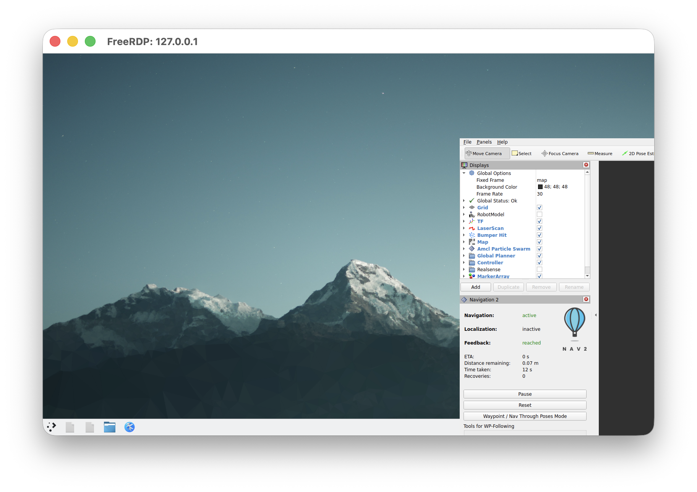

# Runtime Verification

Last checked: 2026-06-20.

## Host

```text
macOS: 26.5
Architecture: arm64
```

## Git Baseline

```text
Branch: main
Remote: origin/main
Baseline before source-build verification: 10c86ca Document container runtime verification blocker
```

## Completed Checks

```bash
bash -n scripts/attach_container.sh scripts/build_container.sh scripts/container-entrypoint.sh scripts/preflight.sh scripts/start_container.sh scripts/stop_container.sh
```

The simulator JavaScript compiles, and all 32 sensor/compression/network combinations produce finite metrics.

## Installer Signature Check

The official signed installer package was downloaded from the Apple GitHub release:

```text
Release: apple/container 1.0.0
Asset: container-1.0.0-installer-signed.pkg
Size: 89150563 bytes
SHA-256: 13f45f26da94c354adcbefe1e8f7631e7f126e93c5d4dd6a5a538aa66b4f479d
```

The downloaded file size and SHA-256 match the GitHub release metadata, but local macOS package validation failed:

```text
pkgutil --check-signature /private/tmp/container-1.0.0-installer-signed.pkg
Package "container-1.0.0-installer-signed.pkg":
   Status: invalid signature

spctl -a -vv -t install /private/tmp/container-1.0.0-installer-signed.pkg
/private/tmp/container-1.0.0-installer-signed.pkg: internal error in Code Signing subsystem
```

Because the signed installer does not validate locally, it was not installed.

## Source Build Verification

Apple `container` 1.0.0 was built from source instead:

```text
Source: https://github.com/apple/container
Tag: 1.0.0
Commit: ee848e3 Add backward compat for ContainerConfig cpuOverhead
Xcode: 26.5
Swift: 6.3.2
```

The source tree was cloned under `/private/tmp/apple-container-src` to avoid macOS Desktop/Documents virtualization permission issues. The release build completed and produced:

```text
/private/tmp/apple-container-src/bin/container
/private/tmp/apple-container-src/bin/container-apiserver
container CLI version 1.0.0 (build: release, commit: ee848e3)
```

Unit tests passed:

```text
XCTest: 94 tests, 0 failures
Swift Testing: 544 tests in 69 suites passed
```

The upstream integration target initially failed while downloading the Kata kernel:

```text
Installing kernel...
Error: HTTPClientError.connectTimeout
```

The same kernel archive was then downloaded directly and installed from the local tarball:

```text
Archive: kata-static-3.28.0-arm64.tar.zst
SHA-256: f63d54507d1f18635d94475077e4c2330de4d8e05cedf25f7c38f063b0e66a91
Kernel: opt/kata/share/kata-containers/vmlinux-6.18.15-186
```

Apple `container` runtime smoke test passed:

```bash
PATH=/private/tmp/apple-container-src/bin:$PATH container run --rm alpine uname -a
```

```text
Linux a47b421b-a51e-4914-aca8-938008f761b0 6.18.15 #1 SMP Tue Mar 17 01:36:53 UTC 2026 aarch64 Linux
```

Global install was not completed because `make install` requires an interactive `sudo` password. Until the user installs the signed package or completes `make install`, use:

```bash
export PATH=/private/tmp/apple-container-src/bin:$PATH
```

## ROS 2 Image Verification

With the source-built CLI on `PATH`, repo preflight passed:

```bash
PATH=/private/tmp/apple-container-src/bin:$PATH ./scripts/preflight.sh
```

The ROS 2 desktop image built successfully:

```bash
PATH=/private/tmp/apple-container-src/bin:$PATH ./scripts/build_container.sh
```

```text
ros2-mac-container:latest
```

The container launched successfully:

```bash
PATH=/private/tmp/apple-container-src/bin:$PATH ./scripts/start_container.sh
```

```text
ros2_mac_container
RDP: 127.0.0.1:3389
ROS bridge/WebSocket: 127.0.0.1:8765
Zenoh route: 127.0.0.1:7447
ROS 2 socket buffer cap: 16777216 bytes
ROS bridge enabled: 1
Zenoh router enabled: 1
```

Runtime state:

```text
ID                  IMAGE                       OS     ARCH   STATE    IP
ros2_mac_container  ros2-mac-container:latest   linux  arm64  running  192.168.64.6/24
```

Host port listeners were verified:

```text
127.0.0.1:3389  LISTEN
127.0.0.1:8765  LISTEN
127.0.0.1:7447  LISTEN
```

Inside the container, `xrdp`, `xrdp-sesman`, ROS 2, RViz, and the key transport packages were present:

```text
/usr/sbin/xrdp --nodaemon
/usr/sbin/xrdp-sesman --nodaemon
ROS2_OK
/opt/ros/jazzy/bin/rviz2
ros-jazzy-desktop 0.11.0-1noble.20260615.092556
ros-jazzy-rviz2 14.1.22-1noble.20260615.083715
ros-jazzy-compressed-image-transport 4.0.7-1noble.20260614.053443
ros-jazzy-point-cloud-transport 4.0.8-1noble.20260614.051508
ros-jazzy-rmw-cyclonedds-cpp 2.2.3-1noble.20260612.091852
ros-jazzy-rmw-zenoh-cpp 0.2.9-1noble.20260612.051449
```

`rviz2 --help` was not used as a pass/fail check because the Qt GUI binary aborts without an active display in a noninteractive `container exec` shell. Verify RViz visually through RDP.

## RDP and RViz Verification

RDP was verified from macOS with FreeRDP's SDL client:

```bash
sdl-freerdp /v:127.0.0.1:3389 /u:ros /p:ros /cert:ignore /size:1280x800 /dynamic-resolution
```

The KDE/xrdp session started on display `:10.0`. The session may lock automatically; unlock it with password `ros`.

The first RViz launch exposed a CycloneDDS socket buffer mismatch:

```text
failed to increase socket receive buffer size to at least 10485760 bytes, current is 8388608 bytes
rmw_create_node: failed to create domain
```

Linux reported default socket caps of `4194304` bytes:

```text
net.core.rmem_max = 4194304
net.core.wmem_max = 4194304
```

Raising the caps live to `16777216` bytes allowed an `8MB` CycloneDDS profile to pass `ros2 doctor --report`. The container entrypoint now applies that tuning at startup through `ROS2_SOCKET_BUFFER_BYTES`, and the repository CycloneDDS profile requests `8MB` send and receive buffers.

If socket tuning fails on a future runtime, lower `config/cyclonedds.xml` to `4MB` before running ROS graph tools.

The rebuilt container logs confirmed startup tuning:

```text
ROS 2 socket buffer caps set to 16777216 bytes.
```

The rebuilt container also reported:

```text
net.core.rmem_max = 16777216
net.core.wmem_max = 16777216
SocketReceiveBufferSize min="8MB"
SocketSendBufferSize min="8MB"
```

With the tuned runtime, `ros2 doctor --report` completed with:

```text
RMW MIDDLEWARE
middleware name : rmw_cyclonedds_cpp

ROS 2 INFORMATION
distribution name : jazzy
distribution status : active
```

RViz then launched successfully in the RDP session:

```text
[INFO] [rviz2]: Stereo is NOT SUPPORTED
[INFO] [rviz2]: OpenGl version: 4.5 (GLSL 4.5)
```

Visual proof for the tuned `8MB` profile was captured locally at `/private/tmp/ros2-rdp-rviz-8mb.png`.

## GitHub Pages Verification

GitHub Pages is enabled from `main` and `/docs`:

```text
URL: https://sandeep-devarapalli.github.io/ros2-mac-container/
Status: built
HTTPS enforced: true
```

The public URL returned `HTTP/2 200` and served `docs/index.html`.

The public simulator was exercised with a browser smoke test against the published URL. All sensor, compression, and network selector combinations updated metrics successfully:

```text
Exercised 32 public simulator combinations; 10 showed saturation warnings.
```

Local static checks also pass:

```bash
bash -n scripts/*.sh
python3 -m py_compile scripts/check_rosbridge_websocket.py
node scripts/check_simulator.mjs
```

## ROS Bridge and Zenoh Verification

The rebuilt container entrypoint starts rosbridge and Zenoh automatically:

```text
ROS bridge WebSocket starting on port 8765.
Zenoh router starting with /opt/ros2-mac-container/zenoh-router.json5.
```

Service logs confirm both processes are active:

```text
Rosbridge WebSocket server started on port 8765
Zenoh can be reached at: tcp/192.168.64.6:7447
Started Zenoh router with id 84199e97d403ab14f1a2783a36f0d09b
```

Host port checks passed:

```text
Connection to 127.0.0.1 port 8765 [tcp/ultraseek-http] succeeded!
Connection to 127.0.0.1 port 7447 [tcp/*] succeeded!
```

The standard runtime smoke now wraps the host port checks, rosbridge WebSocket smoke, `ros2 doctor --report`, and process/log checks:

```bash
scripts/check_runtime_networking.sh
```

Latest result:

```text
OK: RDP reachable at 127.0.0.1:3389
OK: ROS bridge WebSocket reachable at 127.0.0.1:8765
OK: Zenoh router reachable at 127.0.0.1:7447
rosbridge websocket smoke received: rosbridge smoke ok
OK: ros2 doctor completed inside ros2_mac_container
OK: rosbridge process is running
OK: Zenoh process is running
OK: rosbridge startup log found
OK: Zenoh startup log found
Runtime networking smoke passed for ros2_mac_container.
```

The dependency-free WebSocket smoke published `std_msgs/String` to `/codex_rosbridge_smoke` and received it back through the rosbridge subscription:

```text
rosbridge websocket smoke received: rosbridge smoke ok
```

`ros2 doctor --report` still completed with `rmw_cyclonedds_cpp`, and the live topic list included rosbridge topics plus `/codex_rosbridge_smoke`.

## Turtlesim Verification

The lightweight simulator path was verified through the live RDP desktop before installing heavier Nav2 or Gazebo packages.

A temporary FreeRDP session created display `:10`, then `turtlesim_node` launched successfully:

```bash
source /opt/ros/jazzy/setup.bash
DISPLAY=:10 XAUTHORITY=/home/ros/.Xauthority ros2 run turtlesim turtlesim_node
```

The node exposed the expected ROS graph:

```text
/turtle1/cmd_vel
/turtle1/color_sensor
/turtle1/pose
/turtlesim
```

Publishing a velocity command moved the turtle. Pose before command:

```text
x: 5.544444561004639
y: 5.544444561004639
theta: 0.0
```

Pose after command:

```text
x: 7.343994140625
y: 6.3257293701171875
theta: 0.8064000010490417
```

Visual proof was captured locally at `/private/tmp/ros2-turtlesim-smoke.png`.

## Minimal TurtleBot Gazebo Bridge Verification

The lightest TurtleBot/Gazebo path was tested live in the running container before adding any simulator packages to the image.

The package was installed only in the current container:

```bash
apt-get update
DEBIAN_FRONTEND=noninteractive apt-get install -y ros-jazzy-nav2-minimal-tb3-sim
```

Installed versions:

```text
ros-jazzy-nav2-minimal-tb3-sim 1.0.1-1noble.20260614.084159
ros-jazzy-ros-gz-bridge         1.0.22-1noble.20260612.145221
ros-jazzy-ros-gz-sim            1.0.22-1noble.20260614.054729
```

The install pulled `164` packages, downloaded `131 MB`, and used about `555 MB` of additional disk in the live container.

This package is not a full Nav2 bringup. In this Jazzy package version it provides:

```text
/opt/ros/jazzy/share/nav2_minimal_tb3_sim/launch/spawn_tb3.launch.py
/opt/ros/jazzy/share/nav2_minimal_tb3_sim/configs/turtlebot3_waffle_bridge.yaml
/opt/ros/jazzy/share/nav2_minimal_tb3_sim/worlds/tb3_sandbox.sdf.xacro
```

It starts the Gazebo bridge and spawns the robot, but the Gazebo server must be started separately.

A headless world expanded cleanly:

```bash
source /opt/ros/jazzy/setup.bash
xacro /opt/ros/jazzy/share/nav2_minimal_tb3_sim/worlds/tb3_sandbox.sdf.xacro headless:=true > /tmp/tb3_sandbox_headless.sdf
```

Gazebo server-only mode started with:

```bash
source /opt/ros/jazzy/setup.bash
export GZ_SIM_RESOURCE_PATH=/opt/ros/jazzy/share/nav2_minimal_tb3_sim/models:/opt/ros/jazzy/share
ros2 launch ros_gz_sim gz_sim.launch.py gz_args:="-r -s /tmp/tb3_sandbox_headless.sdf"
```

The TurtleBot bridge and spawn launch then started with:

```bash
source /opt/ros/jazzy/setup.bash
export GZ_SIM_RESOURCE_PATH=/opt/ros/jazzy/share/nav2_minimal_tb3_sim/models:/opt/ros/jazzy/share
ros2 launch nav2_minimal_tb3_sim spawn_tb3.launch.py
```

The ROS graph exposed the expected bridge topics:

```text
/clock
/cmd_vel
/imu
/joint_states
/odom
/scan
/tf
```

The active bridge process reported:

```text
Creating GZ->ROS Bridge: [/clock]
Creating GZ->ROS Bridge: [/joint_states]
Creating GZ->ROS Bridge: [/odom]
Creating GZ->ROS Bridge: [/tf]
Creating GZ->ROS Bridge: [/imu]
Creating GZ->ROS Bridge: [/scan]
Creating ROS->GZ Bridge: [cmd_vel]
```

Publishing a velocity command changed simulated odometry. Pose before command:

```text
x: 2.2371907111851046e-07
y: 3.3227224807908604e-16
z: 0.0
orientation.z: 1.4852209778317137e-09
orientation.w: 1.0
```

Pose after command:

```text
x: 0.4989049568687094
y: 0.5330766650723803
z: 0.0
orientation.z: 0.7301209934483827
orientation.w: 0.6833178871696151
```

Gazebo emitted a local-discovery warning:

```text
Couldn't find a preferred IP via the getifaddrs() call; I'm assuming that your IP address is 127.0.0.1.
```

That warning did not block local in-container simulation, but it should be investigated before treating Gazebo transport as a remote robot networking path. ROS bridge and Zenoh remain the repo's verified network paths for external clients.

## Full Nav2 Loopback Verification

Full Nav2 packages were installed only in the running container:

```bash
apt-get update
DEBIAN_FRONTEND=noninteractive apt-get install -y \
  ros-jazzy-navigation2 \
  ros-jazzy-nav2-bringup \
  ros-jazzy-slam-toolbox \
  ros-jazzy-turtlebot3-gazebo \
  ros-jazzy-turtlebot3-navigation2 \
  ros-jazzy-nav2-loopback-sim
```

The full package layer added `143` packages, downloaded `100 MB`, and used about `607 MB`. `ros-jazzy-nav2-loopback-sim` was a separate required package; it added `3` packages, downloaded `1.4 MB`, and used about `1.8 MB`.

Installed versions:

```text
ros-jazzy-navigation2              1.3.12-1noble.20260615.092426
ros-jazzy-nav2-bringup             1.3.12-1noble.20260615.095620
ros-jazzy-slam-toolbox             2.8.5-1noble.20260614.104642
ros-jazzy-turtlebot3-gazebo        2.3.7-1noble.20260614.084413
ros-jazzy-turtlebot3-navigation2   2.3.6-1noble.20260615.101748
ros-jazzy-nav2-loopback-sim        1.3.12-1noble.20260614.054648
```

The available launch files differ from older TurtleBot tutorials:

```text
/opt/ros/jazzy/share/nav2_bringup/launch/tb3_loopback_simulation.launch.py
/opt/ros/jazzy/share/turtlebot3_navigation2/launch/navigation2.launch.py
/opt/ros/jazzy/share/turtlebot3_gazebo/launch/turtlebot3_world.launch.py
```

An early smoke used only a static `map -> odom` transform and stalled the command path. That made lifecycle activation possible but did not initialize the loopback simulator's laser and odometry timers:

```text
Failed to activate global_costmap because transform from base_link to map did not become available before timeout
Failed to bring up all requested nodes. Aborting bringup.
```

A clean headless launch starts the Nav2 loopback simulator, then publishes `/initialpose` using a known free-space start pose from the `tb3_sandbox` map:

```bash
source /opt/ros/jazzy/setup.bash
ros2 launch nav2_bringup tb3_loopback_simulation.launch.py use_rviz:=False
```

```bash
source /opt/ros/jazzy/setup.bash
ros2 topic pub --once /initialpose geometry_msgs/msg/PoseWithCovarianceStamped \
  "{header: {frame_id: map}, pose: {pose: {position: {x: -2.0, y: -0.5, z: 0.0}, orientation: {w: 1.0}}}}"
```

The `/initialpose` message is the important step. The loopback simulator ignores velocity updates and does not start laser scan publishing until it receives an initial pose.

All checked lifecycle nodes reached `active [3]`:

```text
map_server active [3]
controller_server active [3]
smoother_server active [3]
planner_server active [3]
behavior_server active [3]
bt_navigator active [3]
waypoint_follower active [3]
velocity_smoother active [3]
route_server active [3]
collision_monitor active [3]
docking_server active [3]
```

The expected Nav2 graph was present:

```text
/clock
/cmd_vel
/cmd_vel_nav
/cmd_vel_smoothed
/goal_pose
/initialpose
/map
/odom
/plan
/scan
/tf
/tf_static
```

The loopback simulator published `/clock` at about `10 Hz`, and Nav2 exposed the expected action servers, including:

```text
/compute_path_to_pose [nav2_msgs/action/ComputePathToPose]
/follow_path [nav2_msgs/action/FollowPath]
/navigate_to_pose [nav2_msgs/action/NavigateToPose]
```

A goal from known free space `(-2.0, -0.5)` to `(2.0, 0.0)` was accepted:

```text
Goal accepted with ID: 34135c81a0c7485a8a1a3c876f47ee77
distance_remaining: 4.300278663635254
```

The planner published a `/plan` beginning at the expected start pose:

```text
frame_id: map
position:
  x: -1.9999998807907104
  y: -0.49999985843896866
```

The controller also produced velocity commands on `/cmd_vel_nav` at about `20 Hz`:

```text
linear.x: 0.17421060800552368
angular.z: -0.04227377846837044
```

A follow-up direct command proved the loopback simulator moved once `/initialpose` had initialized it:

```text
Before direct /cmd_vel: map -> base_link translation [-2.000, -0.500, 0.010]
After direct /cmd_vel:  map -> base_link translation [-1.400, -0.500, 0.010]
```

The same loopback launch then completed a real `NavigateToPose` action:

```text
Goal accepted with ID: 7e34e70d57b4466f8c10fd9667add615
Result:
    error_code: 0
error_msg: ''
Goal finished with status: SUCCEEDED
```

Final sampled TF after the goal:

```text
map -> base_link translation [2.039, -0.108, 0.010]
yaw 12.919 degrees
```

`/scan` published from `base_scan`, and `/odom` had one publisher from `loopback_simulator` plus Nav2 subscribers from `controller_server` and `bt_navigator`.

Treat this as a full headless Nav2 loopback proof: package install, lifecycle activation, initial pose, laser scan, goal acceptance, planning, controller output, final command path, loopback motion, and action success are verified.

## RDP/RViz Visual Proof

The same `/initialpose` plus `NavigateToPose` workflow was run with RViz visible over the RDP desktop:



The RViz Navigation 2 panel showed:

```text
Navigation: active
Feedback: reached
ETA: 0 s
Distance remaining: 0.07 m
Time taken: 12 s
Recoveries: 0
```

The terminal side of the same run returned:

```text
Result:
    error_code: 0
error_msg: ''
Goal finished with status: SUCCEEDED
map -> base_link translation [2.039, -0.061, 0.010]
yaw 11.905 degrees
```

## Next Safe Step

The next simulator step is deciding whether Nav2 stays as an optional live-container install or gets baked into the image. Keep it optional if the base image should stay focused on ROS desktop, RDP, rosbridge, Zenoh, and transport tooling; bake it in if repeatable navigation simulation matters more than image size and rebuild time.

The signed installer should still not be installed until local package signature validation succeeds. For now, use the source-built CLI path above, or complete Apple-documented source installation interactively with `sudo`, then rerun:

```bash
./scripts/preflight.sh
./scripts/build_container.sh
./scripts/start_container.sh
```
