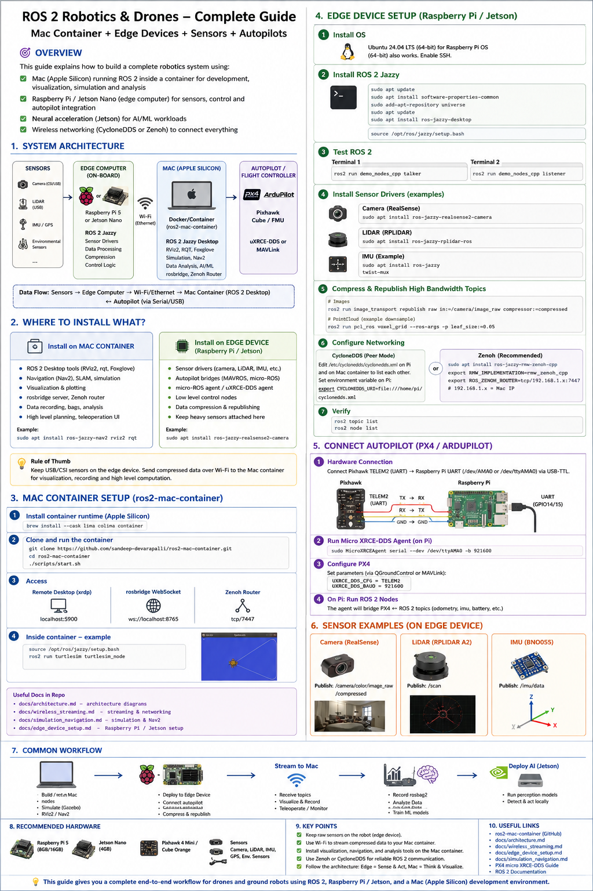
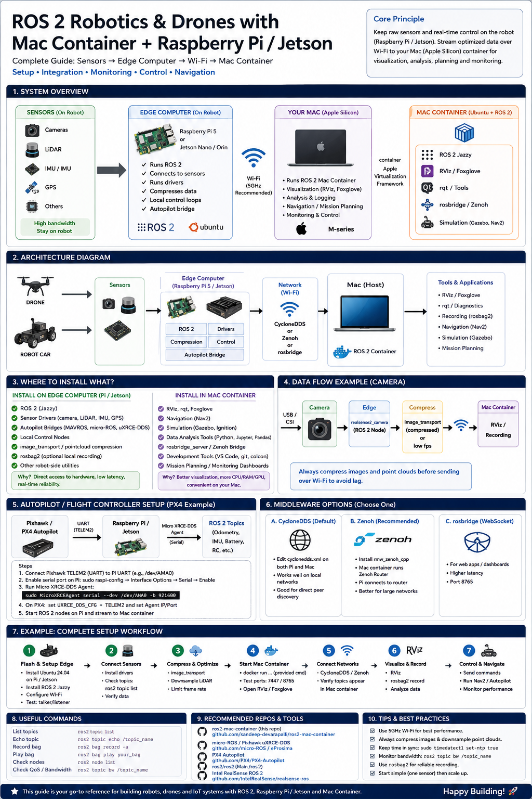

# Integrating Sensors and Raspberry Pi 5 with ROS 2 for Robotic & IoT Applications

## 1 Overview

Building robotic or IoT solutions around a Raspberry Pi 5 (RPi5) requires three capabilities:

- **Remote access and device management** – you need to configure and update the Pi remotely, whether it sits under your desk or inside a robot.
- **Sensor data acquisition** – environment sensors, cameras and LiDARs must be powered, wired to the Pi’s GPIO or USB ports, and read reliably.
- **ROS 2 integration and autopilot connectivity** – sensor data often needs to be exposed to ROS 2 so that higher‑level algorithms (SLAM, navigation, etc.) can run either on the Pi or on a companion computer; when using drones or rovers the Pi also has to communicate with an autopilot.

This document summarises how to achieve those goals based on recent documentation and open‑source projects (June 2026) and proposes code examples and projects to get you started.

## 2 Remote access and device management

### 2.1 Remote Desktop via RDP/RealVNC

For occasional graphical access you can install a remote desktop server on the Pi and connect from a PC:

1.  **Install xrdp** – on the Pi, run `sudo apt‑get install xrdp`. The Element14 guide explains that this downloads and installs an RDP server and only takes a few minutes[\[1\]](https://community.element14.com/products/raspberry-pi/raspberrypi_projects/w/documents/890/connecting-to-a-remote-desktop-on-the-raspberry-pi#:~:text=5,software%20on%20the%20Raspberry%20Pi).
2.  **Install a client on your PC** – Microsoft Remote Desktop (Windows/macOS), `rdesktop`/`grdesktop` on Linux or other RDP clients. When connecting, specify the Pi’s IP address and credentials[\[2\]](https://community.element14.com/products/raspberry-pi/raspberrypi_projects/w/documents/890/connecting-to-a-remote-desktop-on-the-raspberry-pi#:~:text=Remote%20Desktop%20is%20an%20application,Microsoft%20Remote%20Desktop).
3.  **Find the Pi’s IP address** – run `ifconfig` on the Pi or look it up in your router’s admin page[\[3\]](https://community.element14.com/products/raspberry-pi/raspberrypi_projects/w/documents/890/connecting-to-a-remote-desktop-on-the-raspberry-pi#:~:text=2,of%20your%20RPi). Alternatively, assign a static IP or mDNS name (e.g., `pi.local`) via your router.

After installation the Pi can be accessed through a window on your main computer, allowing you to use its desktop without a monitor[\[4\]](https://community.element14.com/products/raspberry-pi/raspberrypi_projects/w/documents/890/connecting-to-a-remote-desktop-on-the-raspberry-pi#:~:text=like%20the%20GUI%20screen%20you,in%20directly%20on%20your%20RPi).

### 2.2 Raspberry Pi Connect (remote shell & screen sharing)

Raspberry Pi Connect is an official cloud service that offers **browser‑based shell and screen‑sharing** for Pis running Raspberry Pi OS Bookworm (Wayland). A digital‑picture‑frame article (Dec 2024) notes that Connect allows you to access the Pi’s terminal and desktop from anywhere without opening ports or being on the same network; the author praises it as a free, beta‑stage tool that works even on headless installations[\[5\]](https://www.thedigitalpictureframe.com/why-raspberry-pi-connect-is-the-perfect-screen-sharing-and-remote-shell-tool-for-your-digital-photo-frame/#:~:text=By%20accident%2C%20I%20recently%20stumbled,access%20to%20a%20Raspberry%20Pi). Screen sharing requires Wayland (Bookworm) but remote shell access also works on Pi OS Lite[\[6\]](https://www.thedigitalpictureframe.com/why-raspberry-pi-connect-is-the-perfect-screen-sharing-and-remote-shell-tool-for-your-digital-photo-frame/#:~:text=Screen%20sharing%20requires%20the%20Wayland,remote%20control%20has%20Bookworm%20OS). To use it:

1.  Install Raspberry Pi OS Bookworm (desktop or Lite) on the Pi and update it.
2.  Sign in to your Raspberry Pi account at [connect.raspberrypi.com](https://connect.raspberrypi.com) and register the device.
3.  Enable Connect on the Pi: install the `raspberrypi-connect` package and follow the instructions in the **Raspberry Pi Connect documentation** (the service will prompt you to link the device).
4.  Once registered, you can open a shell or screen‑sharing session from the web portal.

### 2.3 balenaCloud / openBalena for fleet management

If you need to manage multiple devices at scale, balena offers two related platforms:

- **balenaCloud** – a hosted platform that manages fleets of Linux‑based IoT devices. It provides over‑the‑air updates, a built‑in VPN, logging, and device environment variables. Open‑source `balena CLI` is used to push containers and monitor devices. The `open‑source` balena‑sense project uses balenaCloud as a backend and provides a “Deploy with balena” button. BalenaCloud is free for up to ten devices.
- **openBalena** – a self‑hosted version of balenaCloud. The openBalena README describes it as a platform for deploying and managing connected devices; devices run balenaOS and are managed through the balena CLI. OpenBalena provides simple provisioning, remote updates, container‑based deployments, scalability and a built‑in VPN. A table summarises that openBalena is self‑hosted, single‑user and uses full Docker images, while balenaCloud offers multi‑user support, delta‑image updates and a web dashboard. Use openBalena if you need control over your infrastructure and are comfortable running a server.

The Balena ecosystem also offers tools for flashing SD cards (balenaEtcher), CLI management and Python and Node SDKs. Etcher is a cross‑platform utility that safely flashes OS images to SD cards and prevents overwriting your hard drive.

## 3 Acquiring sensor data on Raspberry Pi 5

### 3.1 Environmental sensors (temperature, humidity, etc.)

**balenaSense** is an open‑source project that lets you collect environmental data using I²C sensors and view it on a Grafana dashboard. It supports sensors like the Bosch **BME680** and runs on a Raspberry Pi using containers. The README describes it as a starter project to monitor temperature, humidity and air‑quality data from a variety of sensors. Key points:

- The project uses **InfluxDB** for data storage and **Grafana** for dashboards; the sensors are read via a *sensor block* that uses Linux’s Industrial IO (IIO) drivers. Only non‑HAT I²C sensors are supported; 1‑wire and Pimoroni Enviro HATs are no longer supported.
- You can deploy balenaSense in two ways: (1) click the **Deploy with balena** button to create a balenaCloud application; or (2) add your device to the [balenaSense Open Fleet](https://hub.balena.io/balenalabs/balenasense) to try it without an account.
- Once deployed, navigate to the device’s public URL to view a Grafana dashboard that shows temperature, humidity and pressure. The data is stored in InfluxDB and can be queried or integrated with other systems (e.g., Home Assistant).

**Alternative:** if you prefer not to use balenaCloud, you can read sensors directly via Python using libraries like [Adafruit BME680](https://github.com/adafruit/Adafruit_BME680) and push data into a local InfluxDB or publish it to ROS 2. The following Python snippet demonstrates reading a BME680 sensor and publishing data to a ROS 2 topic:

    import time
    import board
    import busio
    import adafruit_bme680
    import rclpy
    from rclpy.node import Node
    from sensor_msgs.msg import Temperature, RelativeHumidity, FluidPressure

    class EnvPublisher(Node):
        def __init__(self):
            super().__init__('env_publisher')
            i2c = busio.I2C(board.SCL, board.SDA)
            self.bme680 = adafruit_bme680.Adafruit_BME680_I2C(i2c)
            self.temp_pub = self.create_publisher(Temperature, 'temperature', 10)
            self.hum_pub  = self.create_publisher(RelativeHumidity, 'humidity', 10)
            self.press_pub = self.create_publisher(FluidPressure, 'pressure', 10)
            self.timer = self.create_timer(1.0, self.publish_readings)

        def publish_readings(self):
            temp_msg = Temperature()
            temp_msg.temperature = self.bme680.temperature
            self.temp_pub.publish(temp_msg)
            hum_msg = RelativeHumidity()
            hum_msg.relative_humidity = self.bme680.humidity / 100.0
            self.hum_pub.publish(hum_msg)
            press_msg = FluidPressure()
            press_msg.fluid_pressure = self.bme680.pressure * 100.0  # hPa to Pa
            self.press_pub.publish(press_msg)
            self.get_logger().info(
                f'T={temp_msg.temperature:.1f}°C H={hum_msg.relative_humidity:.2%} P={press_msg.fluid_pressure:.0f}Pa'
            )

    rclpy.init()
    node = EnvPublisher()
    rclpy.spin(node)
    node.destroy_node()
    rclpy.shutdown()

This code uses the Adafruit library to communicate with the BME680 via I²C, and publishes `sensor_msgs` topics using ROS 2; it can be run on Raspberry Pi OS with `ros2 run` after installing the necessary packages.

### 3.2 Publishing LiDAR data to ROS 2

A tutorial by Makers Pet (June 2026) provides a fully open‑source way to publish LiDAR data from LDROBOT LD14P, Xiaomi LDS02RR or 3irobotix Delta‑2A sensors to a ROS 2 `/scan` topic on the RPi5. The approach is summarised below:

1.  **Free the GPIO UART** – enable the UART and disable the serial console by editing `/boot/firmware/config.txt` to add `enable_uart=1` and `dtparam=uart0=on`, remove `console=serial0,115200` from `cmdline.txt` and disable the serial‑getty service; add your user to the `dialout` and `gpio` groups and reboot[\[7\]](https://makerspet.com/blog/tutorial-publish-2d-lidar-to-ros2-laserscan-raspberry-pi/#:~:text=Step%201%20%E2%80%94%20Free%20the,Pi%E2%80%99s%20GPIO%20UART).
2.  **Install Podman (or Docker)** – run `sudo apt update && sudo apt install -y podman`[\[8\]](https://makerspet.com/blog/tutorial-publish-2d-lidar-to-ros2-laserscan-raspberry-pi/#:~:text=Step%202%20%E2%80%94%20Install%20Podman). The LiDAR node will run inside a container so your host remains clean.
3.  **Build the** `lds_ros2` **package** – clone the repo, build a ROS 2 Jazzy image and compile the workspace:

<!-- -->

    git clone https://github.com/kaiaai/lds_ros2 ~/lds_ros2
    cd ~/lds_ros2
    ./docker/build.sh            # build ROS 2 Jazzy container image
    ./docker/run.sh colcon build # compile lds_ros2 inside the container

This will build a C++ node (`lds_node`) that reads scan packets from a serial port, bins a full rotation into a `LaserScan` message and publishes `/scan`[\[9\]](https://makerspet.com/blog/tutorial-publish-2d-lidar-to-ros2-laserscan-raspberry-pi/#:~:text=Clone%20the%20repo%2C%20build%20the,once%2C%20then%20compile%20the%20workspace).

1.  **Run the LiDAR** – launch the node using a suitable parameter file:

<!-- -->

    ./docker/run.sh bash -lc \
      'source install/setup.bash && \
       ros2 launch lds_ros2 lds.launch.py params:=ld14p.yaml'

Replace `ld14p.yaml` with `lds02rr.yaml` or `delta_2a.yaml` as appropriate[\[10\]](https://makerspet.com/blog/tutorial-publish-2d-lidar-to-ros2-laserscan-raspberry-pi/#:~:text=Step%205%20%E2%80%94%20The%20LDS02RR,2A). To verify data flow, run `ros2 topic hz /scan` in another shell[\[11\]](https://makerspet.com/blog/tutorial-publish-2d-lidar-to-ros2-laserscan-raspberry-pi/#:~:text=Step%204%20%E2%80%94%20Run%20the,LD14P%20and%20see%20the%20scan).

1.  **Tested on Pi 5** – the author reports running the node on a Pi 5 with ROS 2 Jazzy in Podman and achieving a steady 6 Hz scan rate with the Delta‑2A LiDAR[\[12\]](https://makerspet.com/blog/tutorial-publish-2d-lidar-to-ros2-laserscan-raspberry-pi/#:~:text=Tested%20on%20a%20Raspberry%20Pi,5).

For robots using other LiDARs, you can adapt the `lds_ros2` package or write your own driver that reads from `/dev/ttyAMA0` and publishes `sensor_msgs/LaserScan` messages.

### 3.3 Cameras

The Pi Camera V3 works on Pi 5 using the **libcamera** stack (`picamera2` library) and ROS 2 packages such as `image_transport`. For ROS 2 streaming, you can use the [ros-perception/image_pipeline](https://github.com/ros-perception/image_pipeline) package; the following Python node publishes images from the Pi camera:

    import rclpy
    from rclpy.node import Node
    from sensor_msgs.msg import Image
    from cv_bridge import CvBridge
    from picamera2 import Picamera2

    class CameraPublisher(Node):
        def __init__(self):
            super().__init__('camera_publisher')
            self.bridge = CvBridge()
            self.pub = self.create_publisher(Image, 'camera/image', 10)
            self.camera = Picamera2()
            self.camera.configure(self.camera.create_still_configuration())
            self.camera.start()
            self.timer = self.create_timer(1/30, self.capture)

        def capture(self):
            frame = self.camera.capture_array()
            msg = self.bridge.cv2_to_imgmsg(frame, encoding='rgb8')
            self.pub.publish(msg)

    rclpy.init()
    node = CameraPublisher()
    rclpy.spin(node)
    node.destroy_node()
    rclpy.shutdown()

This example uses `picamera2` (installed via `sudo apt install python3-picamera2`) and `cv_bridge` (from `ros-humble-cv-bridge`) to publish a 30 FPS RGB image stream. Use `rqt_image_view` or `rviz2` to visualise the images.

### 3.4 Other sensors and IoT simulators

- **Azure Raspberry Pi Web Simulator** – Azure provides a web‑based simulator that emulates a Pi with a connected LED. The repository’s README notes that the project is archived but can still send messages to an Azure IoT hub via a web client; it shows how to replace the connection string with your own IoT hub device and run the sample. Use this to test cloud connectivity before working with hardware.
- **Custom sensor drivers** – for sensors without Linux kernel drivers, write a Python or C++ node that reads data over SPI/I²C/UART and publishes ROS 2 messages. The general pattern is: (1) configure the interface using `dtparam` or `dtoverlay`; (2) open the device (e.g., `/dev/i2c-1`); (3) read and decode packets; (4) publish to ROS 2.

## 4 Installing ROS 2 on the Raspberry Pi 5

### 4.1 Choose an OS and ROS 2 distribution

A full ROS 2 installation requires a 64‑bit Linux distribution. The PX4 guide notes that ROS 2 “Humble” corresponds to Ubuntu 22.04, while “Foxy” targets Ubuntu 20.04[\[13\]](https://docs.px4.io/main/en/companion_computer/pixhawk_rpi#:~:text=Ubuntu%20Setup%20on%20RPi). Ubuntu Server or Desktop can be installed using the Raspberry Pi Imager; the micro‑ROS tutorial uses the Imager’s custom OS option to flash Ubuntu 22.04 and enables SSH and Wi‑Fi settings before writing the SD card[\[14\]](https://jschrier.github.io/blog/2023/01/06/ROS-Setup-For-Raspberry-Pi-and-Pico.html#:~:text=Install%20Ubuntu%20on%20your%20Raspberry,Pi).

### 4.2 Enable the UART and configure the system

If you plan to connect serial devices (LiDARs, autopilots), enable the UART and disable the Bluetooth overlay. The PX4 guide instructs to run `sudo raspi-config`, disable the serial login shell, enable the serial interface and add the following lines to `/boot/firmware/config.txt`[\[15\]](https://docs.px4.io/main/en/companion_computer/pixhawk_rpi#:~:text=sudo%20nano%20%2Fboot%2Ffirmware%2Fconfig):

    enable_uart=1
    dtoverlay=disable-bt

After saving and rebooting, the serial port appears as `/dev/ttyAMA0` (also `/dev/serial0`)[\[16\]](https://docs.px4.io/main/en/companion_computer/pixhawk_rpi#:~:text=cd%20%2F%20ls%20%2Fdev%2FttyAMA0).

### 4.3 Install ROS 2 packages

Follow the official ROS 2 installation guide. The micro‑ROS tutorial summarises the steps for ROS 2 Humble:

    # enable Universe repository and install dependencies
    sudo apt install software-properties-common
    sudo add-apt-repository universe
    sudo apt update && sudo apt install curl

    # add the ROS 2 apt repository and key
    sudo curl -sSL https://raw.githubusercontent.com/ros/rosdistro/master/ros.key \
      -o /usr/share/keyrings/ros-archive-keyring.gpg

    echo "deb [arch=$(dpkg --print-architecture) signed-by=/usr/share/keyrings/ros-archive-keyring.gpg] \
      http://packages.ros.org/ros2/ubuntu $(. /etc/os-release && echo $UBUNTU_CODENAME) main" | \
      sudo tee /etc/apt/sources.list.d/ros2.list > /dev/null

    sudo apt update
    sudo apt upgrade

    # install ROS 2 desktop and developer tools
    sudo apt install ros-humble-desktop ros-dev-tools

After installation, source the setup script and test the talker/listener demo:

    source /opt/ros/humble/setup.bash
    ros2 run demo_nodes_cpp talker   # Terminal 1
    ros2 run demo_nodes_py listener  # Terminal 2

If both nodes communicate, ROS 2 is working[\[17\]](https://jschrier.github.io/blog/2023/01/06/ROS-Setup-For-Raspberry-Pi-and-Pico.html#:~:text=1,Python%20APIs%20are%20working%20properly).

### 4.4 Using Podman/Docker

Running ROS 2 inside containers keeps the host clean and facilitates cross‑deployment. The LiDAR tutorial uses Podman to build a `ros:jazzy` image and runs ROS 2 nodes inside it[\[18\]](https://makerspet.com/blog/tutorial-publish-2d-lidar-to-ros2-laserscan-raspberry-pi/#:~:text=Step%202%20%E2%80%94%20Install%20Podman). balenaCloud also deploys applications as containers.

## 5 Integrating autopilots (Pixhawk) with Raspberry Pi

A Raspberry Pi can act as a **companion computer** for a Pixhawk autopilot. The PX4 documentation provides a detailed tutorial summarised below.

### 5.1 Wiring the connection

Connect the Pixhawk `TELEM2` port to the Pi’s UART pins:

| Pixhawk TELEM2 pin | RPi GPIO pin         | Purpose           |
|--------------------|----------------------|-------------------|
| UART5_TX (pin 2)   | GPIO 15 (pin 10) RXD | Pixhawk → Pi data |
| UART5_RX (pin 3)   | GPIO 14 (pin 8) TXD  | Pi → Pixhawk data |
| GND (pin 6)        | Ground (pin 6)       | Common ground     |

The TELEM2 port is used for off‑board control and is configured for MAVLink by default[\[19\]](https://docs.px4.io/main/en/companion_computer/pixhawk_rpi#:~:text=Serial%20connection).

### 5.2 Configure Ubuntu on the Pi

The guide emphasises that different ROS 2 versions need matching Ubuntu versions (22.04 for Humble, 20.04 for Foxy)[\[13\]](https://docs.px4.io/main/en/companion_computer/pixhawk_rpi#:~:text=Ubuntu%20Setup%20on%20RPi). After flashing Ubuntu:

1.  Install `raspi-config` and run it to disable the serial login shell and enable the serial interface[\[20\]](https://docs.px4.io/main/en/companion_computer/pixhawk_rpi#:~:text=3,and%20then%20click%20Serial%20Port).
2.  Add `enable_uart=1` and `dtoverlay=disable-bt` to `/boot/firmware/config.txt` and reboot[\[15\]](https://docs.px4.io/main/en/companion_computer/pixhawk_rpi#:~:text=sudo%20nano%20%2Fboot%2Ffirmware%2Fconfig).
3.  Verify that `/dev/ttyAMA0` exists[\[16\]](https://docs.px4.io/main/en/companion_computer/pixhawk_rpi#:~:text=cd%20%2F%20ls%20%2Fdev%2FttyAMA0).

### 5.3 Verify MAVLink communication

Although ROS 2 will use DDS, it’s helpful to test the wiring with MAVLink first. The guide suggests installing `mavproxy` on the Pi, setting the baud rate to 57600 and connecting to `/dev/serial0`[\[21\]](https://docs.px4.io/main/en/companion_computer/pixhawk_rpi#:~:text=MAVLink%20is%20the%20default%20and,on%20the%20Pixhawk):

    sudo apt install python3-pip
    sudo pip3 install mavproxy
    sudo apt remove modemmanager

    sudo mavproxy.py --master=/dev/serial0 --baudrate 57600

If MAVProxy connects and you see data in the terminal, the serial link is working[\[21\]](https://docs.px4.io/main/en/companion_computer/pixhawk_rpi#:~:text=MAVLink%20is%20the%20default%20and,on%20the%20Pixhawk).

### 5.4 Switching to ROS 2 via uXRCE‑DDS

PX4 uses **Micro XRCE‑DDS** to communicate with ROS 2. To enable it on the Pixhawk:

1.  In QGroundControl, set the parameters `MAV_1_CONFIG=0` (disable MAVLink on TELEM2), `UXRCE_DDS_CFG=102` (enable uXRCE‑DDS on TELEM2) and `SER_TEL2_BAUD=921600`[\[22\]](https://docs.px4.io/main/en/companion_computer/pixhawk_rpi#:~:text=The%20configuration%20steps%20are%3A). Reboot the flight controller after changing these values[\[23\]](https://docs.px4.io/main/en/companion_computer/pixhawk_rpi#:~:text=You%20will%20need%20to%20reboot,any%20changes%20to%20these%20parameters).
2.  Install the **Micro XRCE‑DDS Agent** on the Pi:

<!-- -->

    sudo apt install git
    git clone https://github.com/eProsima/Micro-XRCE-DDS-Agent.git
    cd Micro-XRCE-DDS-Agent && mkdir build && cd build
    cmake ..
    make
    sudo make install
    sudo ldconfig /usr/local/lib/

Alternatively, use snap or apt packages (see [eProsima docs](https://micro-xrce-dds.docs.eprosima.com)).

1.  Start the agent on the Pi specifying the serial device and baud rate:

<!-- -->

    sudo MicroXRCEAgent serial --dev /dev/serial0 -b 921600

This bridges the DDS network used by ROS 2 to the uXRCE client running on the Pixhawk[\[24\]](https://docs.px4.io/main/en/companion_computer/pixhawk_rpi#:~:text=sh).

1.  Source the ROS environment on the Pi and list the available topics:

<!-- -->

    source /opt/ros/humble/setup.bash
    ros2 topic list

You should see topics published by the Pixhawk (e.g., `/VehicleOdometry`), confirming that ROS 2 is receiving data[\[25\]](https://docs.px4.io/main/en/companion_computer/pixhawk_rpi#:~:text=sh).

Once this connection is established you can write ROS 2 nodes that subscribe to PX4 topics and command the vehicle via ROS 2 publishers. For example, you can send velocity commands by publishing to `VehicleCommand` messages using the `px4_msgs` package.

## 6 micro‑ROS and MCU integration

For microcontrollers like the **Raspberry Pi Pico** you can use **micro‑ROS** to interface with ROS 2. A tutorial from January 2023 describes installing ROS 2 Humble on a Pi and preparing a micro‑ROS development environment[\[14\]](https://jschrier.github.io/blog/2023/01/06/ROS-Setup-For-Raspberry-Pi-and-Pico.html#:~:text=Install%20Ubuntu%20on%20your%20Raspberry,Pi). Key steps:

1.  **Install ROS 2 on the Pi** as described above.
2.  **Install micro‑ROS dependencies** – install `build-essential cmake g++ gcc-arm-none-eabi libnewlib-arm-none-eabi doxygen git python3` and clone the Pico SDK and micro‑ROS sources[\[26\]](https://jschrier.github.io/blog/2023/01/06/ROS-Setup-For-Raspberry-Pi-and-Pico.html#:~:text=1,microROS%20development%20environment%20on%20Ubuntu). Set environment variables for `PICO_SDK_PATH` and `PICO_TOOLCHAIN_PATH`[\[27\]](https://jschrier.github.io/blog/2023/01/06/ROS-Setup-For-Raspberry-Pi-and-Pico.html#:~:text=documentation%20github,gcc%60%20to%20confirm).
3.  **Build the example** – compile the micro‑ROS example and copy the resulting `.uf2` file to the Pico’s storage device (mounted via USB)[\[28\]](https://jschrier.github.io/blog/2023/01/06/ROS-Setup-For-Raspberry-Pi-and-Pico.html#:~:text=1).
4.  **Run micro‑ROS agent** – run the `micro_ros_agent` on the Pi (similar to the uXRCE agent) and verify that the Pico publishes ROS 2 topics.

micro‑ROS allows you to offload low‑level sensor control to a microcontroller while still integrating with ROS 2 on the Pi.

## 7 Open‑source projects to explore

| Project/repository | Purpose and how it helps |
|----|----|
| `balena‑sense` | Starter project for monitoring temperature, humidity and pressure via I²C sensors. Deploy on balenaCloud to get a Grafana dashboard accessible from anywhere. |
| `lds_ros2`[\[9\]](https://makerspet.com/blog/tutorial-publish-2d-lidar-to-ros2-laserscan-raspberry-pi/#:~:text=Clone%20the%20repo%2C%20build%20the,once%2C%20then%20compile%20the%20workspace) | C++ ROS 2 node (with a Podman/Docker build system) that reads LiDAR data via UART and publishes `sensor_msgs/LaserScan` from Pi 5 without a microcontroller. Supports LD14P, LDS02RR and Delta‑2A LiDARs. |
| `kaiaai/LDS` **&** `lds2d` | Libraries used by `lds_ros2` for parsing LiDAR packets; helpful if you need to support new LiDAR models. |
| `open‑balena` | Self‑hosted version of balenaCloud; provides remote updates, VPN and device management for large fleets. |
| `balena‑cli` and `balena‑sdk‑python` | CLI and Python SDK for automating deployments to balenaCloud/openBalena. Useful for scripting fleet management. |
| `Micro‑XRCE‑DDS‑Agent`[\[29\]](https://docs.px4.io/main/en/companion_computer/pixhawk_rpi#:~:text=git%20clone%20https%3A%2F%2Fgithub.com%2FeProsima%2FMicro,make%20install%20sudo%20ldconfig%20%2Fusr%2Flocal%2Flib) | DDS agent bridging ROS 2 and Pixhawk micro DDS clients; essential for uXRCE‑DDS communication. |
| `balena‑et‑cher` | Cross‑platform tool to safely flash OS images to SD cards or USB drives; supports direct flashing of Raspberry Pi devices. |

## 8 Ideas and next steps

- **Create a unified sensor node** – build a ROS 2 package that aggregates data from the BME680 sensor, Pi Camera and a LiDAR and publishes them with synchronised timestamps. Use `rclcpp` or `rclpy` and support configuration via parameters.
- **Automate device provisioning** – use balena CLI / SDK to script provisioning of multiple Pi 5 boards. For example, write a Python script that authenticates with balenaCloud, creates a fleet, registers devices and deploys your sensor application using the Python SDK’s `balena.auth.login()` and device management APIs.
- **Build a simulation environment** – integrate [Gazebo](https://gazebosim.org) or [Webots](https://cyberbotics.com) with ROS 2 to develop your robotics algorithms before deploying on hardware. For IoT simulation, use the Azure Raspberry Pi Web Simulator to prototype IoT hub connectivity.
- **Explore autopilot offboard control** – once ROS 2 and uXRCE‑DDS are working, write ROS 2 nodes that send setpoints to the Pixhawk using the `px4_msgs` package, enabling offboard flight modes. Combine with LiDAR and camera data for SLAM and obstacle avoidance.
- **Implement remote dashboards** – use Grafana or a custom web app to visualise sensor data. In balenaSense the dashboard is built‑in, but you can extend it with additional panels for LiDAR distance histograms or camera images (served via a ROS 2 web bridge).
- **Keep software up to date** – regularly update the Pi’s OS (`sudo apt update && sudo apt upgrade`), ROS 2 packages (`sudo apt install ros-humble-<package>`), LiDAR drivers and balena containers. Balena’s device agent (`helios`) is designed to self‑configure, recover from failures and keep the host and applications healthy; openBalena and balenaCloud also handle remote updates.

## 9 Conclusion

By combining reliable **remote access** (xrdp, Raspberry Pi Connect, balenaCloud), **sensor drivers** (balenaSense for environmental monitoring, LiDAR nodes, camera integration) and a **ROS 2** environment on Ubuntu 22.04/24.04, you can build scalable robotic and IoT applications on the Raspberry Pi 5. When working with drones or rovers, connect the Pi to an autopilot via UART and use **Micro XRCE‑DDS** to bridge data into ROS 2. balenaCloud or openBalena can manage fleets and handle OTA updates, while micro‑ROS extends ROS 2 to microcontrollers such as the Raspberry Pi Pico. These open‑source projects provide a solid foundation for building smart, sensor‑rich robots and IoT devices.

## 10 Mac container vs edge‑device roles

When combining a Raspberry Pi or Jetson with an Apple Silicon Mac, it is important to understand the distinct responsibilities of each layer. The [ros2‑mac‑container](https://github.com/sandeep-devarapalli/ros2-mac-container) project packages an ARM64 Ubuntu 24.04 desktop with ROS 2 Jazzy, KDE/xrdp, rosbridge and a Zenoh router, running inside the Mac’s `container` runtime. This container acts as the **ROS 2 desktop**: it is where you run RViz, rqt, navigation simulations and data‑analysis tools. The project documentation emphasises that you should **not** pass high‑bandwidth USB sensors into the container; instead “keep raw USB devices attached to the edge device” and stream compressed topics over Wi‑Fi.

The **edge device** – a Raspberry Pi 5, Jetson Nano or other robot‑side computer – connects directly to sensors (cameras, LiDAR, IMU) and to an autopilot. It runs Ubuntu (22.04 or 24.04) and a full ROS 2 installation, publishes sensor data locally, compresses streams and forwards them over a dedicated 5 GHz or 6 GHz Wi‑Fi link to the Mac host. The edge‑device guide in the ros2‑mac‑container repository shows how to configure CycloneDDS in peer mode and how to use Zenoh as an alternative transport.

In practice your workflow looks like this:

1.  **Build and run the Mac container** using `scripts/build_container.sh` and `scripts/start_container.sh`, then connect via RDP. Verify that rosbridge (port 8765) and Zenoh (port 7447) are reachable from the Mac host using `./scripts/check_runtime_networking.sh`.
2.  **Flash Ubuntu and install ROS 2** on the edge device. Enable the UART if you plan to connect serial devices and install your sensor drivers (see Sections 3 and 4).
3.  **Connect sensors to the edge device** – attach your BME680, Pi Camera or LiDAR to the Pi/Jetson and publish compressed image and point‑cloud topics; use the sample Python and C++ nodes provided earlier.
4.  **Configure network transport** – in peer mode, add the edge device’s IP to `config/cyclonedds.xml` in the Mac container and set the `RMW_IMPLEMENTATION` and `CYCLONEDDS_URI` variables on the edge device. Alternatively install `ros-jazzy-rmw-zenoh-cpp` on the edge device and set `RMW_IMPLEMENTATION=rmw_zenoh_cpp` to use Zenoh; the container already runs a Zenoh router on port 7447.
5.  **Visualise and analyse** – open RViz inside the container via RDP (`rviz2`) to inspect topics, frames and bandwidth. Use the provided wireless stream simulator to estimate link utilisation and adjust compression settings.

The following schematic summarises the recommended architecture. Sensors remain on the edge device, the Pi/Jetson streams data over Wi‑Fi to the Mac host, and the container hosts ROS 2 desktop tools:

## 11 Autopilot integration with uXRCE‑DDS

For drones or rovers that use a flight controller such as a Pixhawk, the Raspberry Pi acts as a **companion computer**. You wire the autopilot’s TELEM2 port to the Pi’s UART pins (Section 5) and then switch the autopilot from MAVLink to **Micro XRCE‑DDS**. The PX4 documentation shows how to start the Micro XRCE‑DDS Agent on the companion computer over a serial device: `sudo MicroXRCEAgent serial --dev /dev/AMA0 -b 921600`[\[30\]](https://docs.px4.io/main/en/middleware/uxrce_dds#:~:text=Starting%20the%20Agent). On the Pixhawk you set parameters such as `UXRCE_DDS_CFG` and `SER_TEL2_BAUD` to enable the DDS client and specify the baud rate[\[31\]](https://docs.px4.io/main/en/middleware/uxrce_dds#:~:text=for%20the%20communication%20channel%20that,to%20communicate%20with%20the%20agent).

The Pi runs the **uXRCE Agent** which bridges the autopilot’s DDS session into the ROS 2 graph. Once it is running, you can list topics from the Pixhawk using `ros2 topic list` on the Pi. The Mac container will receive these topics over CycloneDDS or Zenoh so that RViz and navigation nodes can subscribe.

The diagram below illustrates the uXRCE‑DDS autopilot integration, showing the serial connection between Pixhawk and Pi, the agent on the Pi, the Wi‑Fi link and the Mac container:

## 12 Jetson, neural accelerators and other edge boards

The same principles apply when using NVIDIA Jetson Nano, Jetson Orin or other neural‑accelerator boards. These boards run Ubuntu (LTS) and support ROS 2; install sensor drivers and autopilot agents on them just as you would on the Pi. The Jetson’s GPU can accelerate perception and inference workloads (e.g., running YOLOv8 or TensorRT‑optimised models) while streaming compressed camera frames to the Mac container. Pair Jetsons with micro‑ROS or uXRCE‑DDS for autopilot integration and use CycloneDDS or Zenoh for network transport.

If you have a microcontroller (e.g., Raspberry Pi Pico, STM32) handling low‑level sensors, use **micro‑ROS** to publish data over serial; run the `micro_ros_agent` on the Pi/Jetson or Mac container and bridge it to ROS 2 as described in Section 6.

------------------------------------------------------------------------

[\[1\]](https://community.element14.com/products/raspberry-pi/raspberrypi_projects/w/documents/890/connecting-to-a-remote-desktop-on-the-raspberry-pi#:~:text=5,software%20on%20the%20Raspberry%20Pi) [\[2\]](https://community.element14.com/products/raspberry-pi/raspberrypi_projects/w/documents/890/connecting-to-a-remote-desktop-on-the-raspberry-pi#:~:text=Remote%20Desktop%20is%20an%20application,Microsoft%20Remote%20Desktop) [\[3\]](https://community.element14.com/products/raspberry-pi/raspberrypi_projects/w/documents/890/connecting-to-a-remote-desktop-on-the-raspberry-pi#:~:text=2,of%20your%20RPi) [\[4\]](https://community.element14.com/products/raspberry-pi/raspberrypi_projects/w/documents/890/connecting-to-a-remote-desktop-on-the-raspberry-pi#:~:text=like%20the%20GUI%20screen%20you,in%20directly%20on%20your%20RPi) Connecting to a Remote Desktop on the Raspberry Pi - element14 Community

<https://community.element14.com/products/raspberry-pi/raspberrypi_projects/w/documents/890/connecting-to-a-remote-desktop-on-the-raspberry-pi>

[\[5\]](https://www.thedigitalpictureframe.com/why-raspberry-pi-connect-is-the-perfect-screen-sharing-and-remote-shell-tool-for-your-digital-photo-frame/#:~:text=By%20accident%2C%20I%20recently%20stumbled,access%20to%20a%20Raspberry%20Pi) [\[6\]](https://www.thedigitalpictureframe.com/why-raspberry-pi-connect-is-the-perfect-screen-sharing-and-remote-shell-tool-for-your-digital-photo-frame/#:~:text=Screen%20sharing%20requires%20the%20Wayland,remote%20control%20has%20Bookworm%20OS) Why Raspberry Pi Connect is the perfect screen sharing and remote shell tool for your digital photo frame maintenance - TheDigitalPictureFrame.com

<https://www.thedigitalpictureframe.com/why-raspberry-pi-connect-is-the-perfect-screen-sharing-and-remote-shell-tool-for-your-digital-photo-frame/>

[\[7\]](https://makerspet.com/blog/tutorial-publish-2d-lidar-to-ros2-laserscan-raspberry-pi/#:~:text=Step%201%20%E2%80%94%20Free%20the,Pi%E2%80%99s%20GPIO%20UART) [\[8\]](https://makerspet.com/blog/tutorial-publish-2d-lidar-to-ros2-laserscan-raspberry-pi/#:~:text=Step%202%20%E2%80%94%20Install%20Podman) [\[9\]](https://makerspet.com/blog/tutorial-publish-2d-lidar-to-ros2-laserscan-raspberry-pi/#:~:text=Clone%20the%20repo%2C%20build%20the,once%2C%20then%20compile%20the%20workspace) [\[10\]](https://makerspet.com/blog/tutorial-publish-2d-lidar-to-ros2-laserscan-raspberry-pi/#:~:text=Step%205%20%E2%80%94%20The%20LDS02RR,2A) [\[11\]](https://makerspet.com/blog/tutorial-publish-2d-lidar-to-ros2-laserscan-raspberry-pi/#:~:text=Step%204%20%E2%80%94%20Run%20the,LD14P%20and%20see%20the%20scan) [\[12\]](https://makerspet.com/blog/tutorial-publish-2d-lidar-to-ros2-laserscan-raspberry-pi/#:~:text=Tested%20on%20a%20Raspberry%20Pi,5) [\[18\]](https://makerspet.com/blog/tutorial-publish-2d-lidar-to-ros2-laserscan-raspberry-pi/#:~:text=Step%202%20%E2%80%94%20Install%20Podman) Tutorial: Publish Your 2D LiDAR to ROS 2 on a Raspberry Pi - Makers Pet

<https://makerspet.com/blog/tutorial-publish-2d-lidar-to-ros2-laserscan-raspberry-pi/>

[\[13\]](https://docs.px4.io/main/en/companion_computer/pixhawk_rpi#:~:text=Ubuntu%20Setup%20on%20RPi) [\[15\]](https://docs.px4.io/main/en/companion_computer/pixhawk_rpi#:~:text=sudo%20nano%20%2Fboot%2Ffirmware%2Fconfig) [\[16\]](https://docs.px4.io/main/en/companion_computer/pixhawk_rpi#:~:text=cd%20%2F%20ls%20%2Fdev%2FttyAMA0) [\[19\]](https://docs.px4.io/main/en/companion_computer/pixhawk_rpi#:~:text=Serial%20connection) [\[20\]](https://docs.px4.io/main/en/companion_computer/pixhawk_rpi#:~:text=3,and%20then%20click%20Serial%20Port) [\[21\]](https://docs.px4.io/main/en/companion_computer/pixhawk_rpi#:~:text=MAVLink%20is%20the%20default%20and,on%20the%20Pixhawk) [\[22\]](https://docs.px4.io/main/en/companion_computer/pixhawk_rpi#:~:text=The%20configuration%20steps%20are%3A) [\[23\]](https://docs.px4.io/main/en/companion_computer/pixhawk_rpi#:~:text=You%20will%20need%20to%20reboot,any%20changes%20to%20these%20parameters) [\[24\]](https://docs.px4.io/main/en/companion_computer/pixhawk_rpi#:~:text=sh) [\[25\]](https://docs.px4.io/main/en/companion_computer/pixhawk_rpi#:~:text=sh) [\[29\]](https://docs.px4.io/main/en/companion_computer/pixhawk_rpi#:~:text=git%20clone%20https%3A%2F%2Fgithub.com%2FeProsima%2FMicro,make%20install%20sudo%20ldconfig%20%2Fusr%2Flocal%2Flib) Raspberry Pi Companion with Pixhawk \| PX4 Guide (main)

<https://docs.px4.io/main/en/companion_computer/pixhawk_rpi>

[\[14\]](https://jschrier.github.io/blog/2023/01/06/ROS-Setup-For-Raspberry-Pi-and-Pico.html#:~:text=Install%20Ubuntu%20on%20your%20Raspberry,Pi) [\[17\]](https://jschrier.github.io/blog/2023/01/06/ROS-Setup-For-Raspberry-Pi-and-Pico.html#:~:text=1,Python%20APIs%20are%20working%20properly) [\[26\]](https://jschrier.github.io/blog/2023/01/06/ROS-Setup-For-Raspberry-Pi-and-Pico.html#:~:text=1,microROS%20development%20environment%20on%20Ubuntu) [\[27\]](https://jschrier.github.io/blog/2023/01/06/ROS-Setup-For-Raspberry-Pi-and-Pico.html#:~:text=documentation%20github,gcc%60%20to%20confirm) [\[28\]](https://jschrier.github.io/blog/2023/01/06/ROS-Setup-For-Raspberry-Pi-and-Pico.html#:~:text=1) ROS Setup for Raspberry Pi and Pico \| Schrier’s Sudelbücher

<https://jschrier.github.io/blog/2023/01/06/ROS-Setup-For-Raspberry-Pi-and-Pico.html>

[\[30\]](https://docs.px4.io/main/en/middleware/uxrce_dds#:~:text=Starting%20the%20Agent) [\[31\]](https://docs.px4.io/main/en/middleware/uxrce_dds#:~:text=for%20the%20communication%20channel%20that,to%20communicate%20with%20the%20agent) uXRCE-DDS (PX4-ROS 2/DDS Bridge) \| PX4 Guide (main)

<https://docs.px4.io/main/en/middleware/uxrce_dds>
